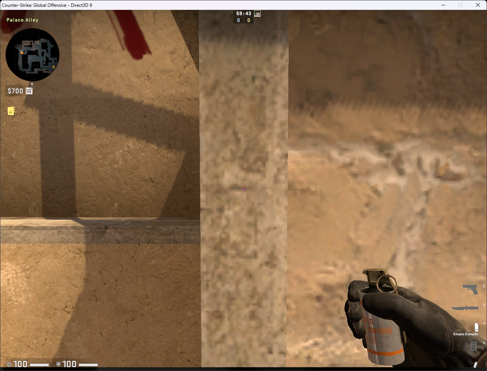
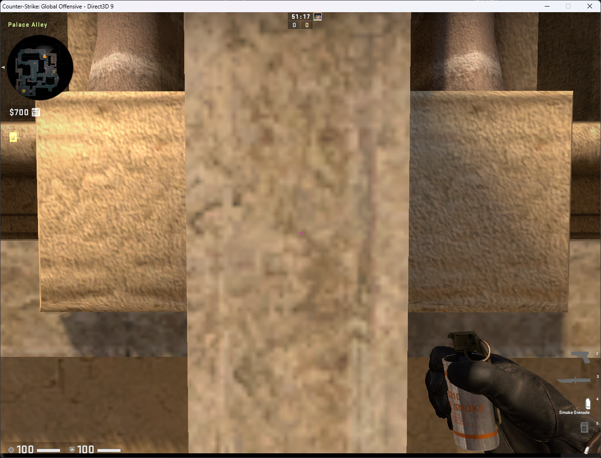

  
<strong>Smoke Ramp to Stairs</strong>

   
  
  Normal Throw
  
  

    

      

        
      

      

        
      

      

        
      

    

  

  
  
  
  

  
<strong>Smoke Ramp to Jungle</strong>

   
  
  Normal Throw

  

    
    
    
  

  

  
<strong>Smoke Ramp to Jungle</strong>

   
  
  Jump Throw

  

    
    
    
  

  

